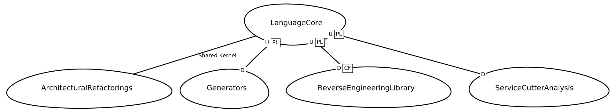

# Context Mapper Example

This example is illustrates the Context Mapper DSL capabilities on the basis of the [Context Mapper framework](https://contextmapper.org/docs/home/) itself. 

Within this folder we modeled our own tool with the CML language as part of our validation activities. The following figure (generated with our [Context Map generator](https://contextmapper.org/docs/context-map-generator/)) illustrates the context map of our framework:  

Here you can find the corresponding context map in CML (Context Mapper Language) in different versions and levels of detail (stages):

 * [ContextMapper-Example-Stage-1](./ContextMapper-Example-Stage-1.cml): A simple context map without relationship patterns in upstream-downstream relationships and without details of the bounded contexts.
 * [ContextMapper-Example-Stage-2](./ContextMapper-Example-Stage-2.cml): This stage refines the relationships on the context map and adds the corresponding DDD relationship patterns.
 * [ContextMapper-Example-Stage-3](./ContextMapper-Example-Stage-3.cml): In stage three we added first details to the bounded contexts and specified the aggregates.
 * [ContextMapper-Example-Stage-4](./ContextMapper-Example-Stage-4.cml): A simple version including all domain objects but no attributes. This stage should still be understandable for users without technical knowledge.
