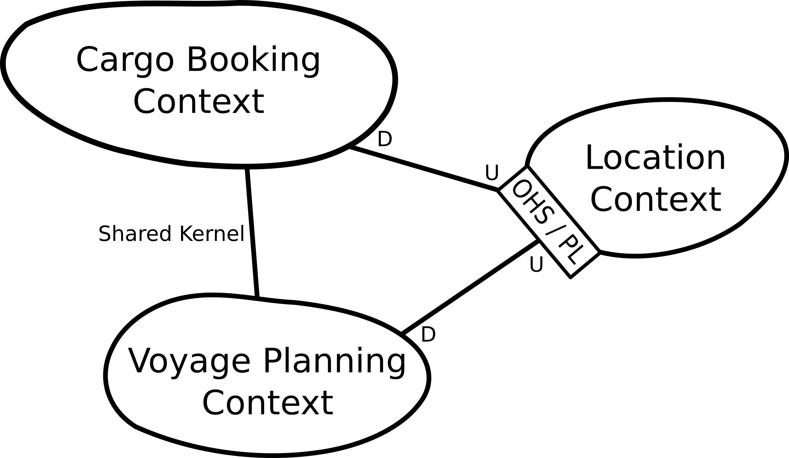

# DDD "Cargo" Sample Application

This example is illustrates the Context Mapper DSL capabilities on the basis the [DDD "Cargo" sample application](https://github.com/citerus/dddsample-core). 

Since CML is dealing with context maps, we divided the application into three bounded contexts. [Evans][1] already mentioned in his book, that the voyage scheduling part is a candidate for a possible bounded contexts. Thus, we made a separate bounded context for this part. Since they still share code, they are in shared kernel relationship. Further we proposed the idea of splitting the locations into a separate bounded context, inspired by the example of [Rademacher][2]. This context could provide everything related to locations as an OPEN HOST SERVICE. Note that this is just an example in order to have another bounded context and must not be a good solution necessarily.

The following figure illustrates the example. 

Here you can find the corresponding context map in CML (Context Mapper Language) in different versions and levels of detail (stages). The first four stages do
not contain detailed domain models and should be understandable for users without technical knowledge (business analysis only). The last stage contains details of
the domain models including attributes for all domain objects and are designed for software engineers and architects.

 * [DDD-Sample-Stage-1](./DDD-Sample-Stage-1.cml): A simple context map without relationship patterns in upstream-downstream relationships and without details of the bounded contexts.
 * [DDD-Sample-Stage-2](./DDD-Sample-Stage-2.cml): This stage refines the relationships on the context map and adds the corresponding DDD relationship patterns.
 * [DDD-Sample-Stage-3](./DDD-Sample-Stage-3.cml): In stage three we added first details to the bounded contexts and specified the modules and aggregates.
 * [DDD-Sample-Stage-4](./DDD-Sample-Stage-4.cml): A simple version including all domain objects but no attributes. This stage should still be understandable for users without technical knowledge.
 * [DDD-Sample-Stage-5](./DDD-Sample-Stage-5.cml): Finally, a detailed context map on the architect and engineering level. All domain objects are specified in detail (including attributes). This example further contains the repositories and services of the DDD sample app.
 * [DDD-Sample_Alternative-Relationship-Syntax](./DDD-Sample_Alternative-Relationship-Syntax.cml): The simple context map example in stage two, but illustrating the alternative relationship syntax.
 * [DDD-Sample_User-Representations](./DDD-Sample_User-Representations.scl): Service Cutter user representations file (for Service Cutter integration) to generate new service cuts

[1]: https://www.oreilly.com/library/view/domain-driven-design-tackling/0321125215/
[2]: https://link.springer.com/chapter/10.1007/978-3-319-74781-1_17
