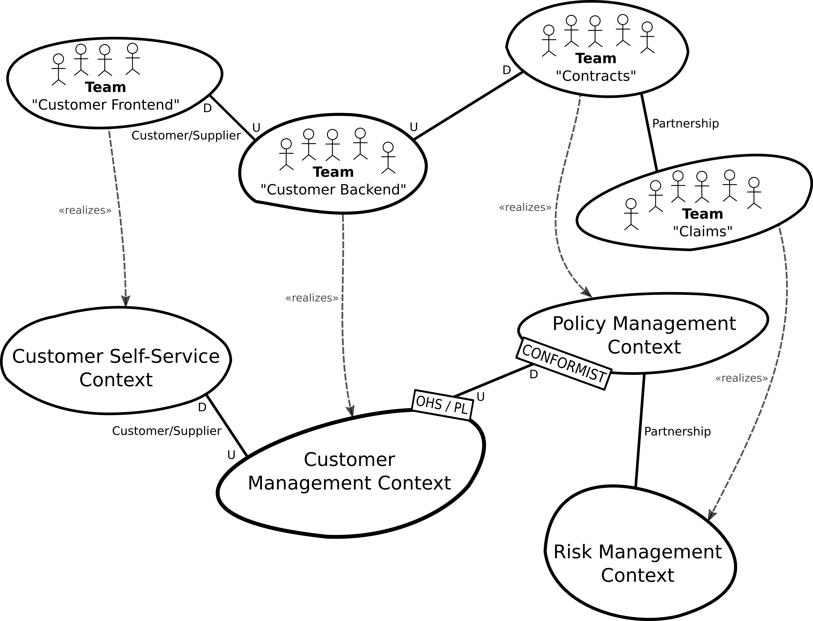

# Insurance Company Example
This example illustrates the Context Mapper DSL capabilities on the basis of a fictitious insurance company scenario. The bounded contexts are partially inspired by the [Lakeside Mutual](https://github.com/Microservice-API-Patterns/LakesideMutual) project.
Note that the goal of the example is to give a representative overview over the DSL's context mapping features. The contexts and their relationships may differ considerably in a real-world insurance company.

## Context Map
The following figure illustrates the Context Map in a graphical representation inspired by [Vernon][1] and [Brandolini][2].

You can find the corresponding context map in CML (Context Mapper Language) here in different versions and levels of detail: 

 * [Insurance-Example-Simple](./Insurance-Example-Simple.cml): Business analysis level (no detailed specification of data types etc.)
 * [Insurance-Example-Detailed](./Insurance-Example-Detailed.cml): Software architect and engineering level
 * [Insurance-Example_Alternative-Relationship-Syntax](./Insurance-Example_Alternative-Relationship-Syntax.cml): Simple context map illustrating the alternative relationship syntax
 * [Insurance-Example_User_Representations](./Insurance-Example_User_Representations.scl): Service Cutter user representations file (for Service Cutter integration) to generate new service cuts

The following bounded contexts are involved in the system:
 * Customer Management
 * Customer Self-Service Management
 * Policy Management
 * Debt Collection
 * Risk Management
 * Printing Context

## Team Map
Besides classic context maps with bounded contexts, CML supports modeling teams and their relationships as it is possible with bounded contexts. This is done by simply change the type of a bounded context from SYSTEM, FEATURE or APPLICATION to TEAM. Note that the type of the context map is ORGANIZATIONAL in this case.

 * [Insurance-Example_Team-Map](./Insurance-Example_Team-Map.cml): A team map example for the insurance example

The following figure is an illustration of the team map, additionally showing the `realization` references:

## Bounded Contexts
 
### Customer Management
The customer management context is responsible for managing all the data of the insurance companies customers. Thus, it is typically a central bounded context which has relationships to many other contexts.

### Customer Self-Service Management
This context represents a web application which allows the customer to login and change basic data records like the address.

### Policy Management
This bounded context manages the contracts and policies of the customers. It works in a _partnership_ together with the risk management context, since it needs the customer risk data for calculating the customer rates. Further, it has a _shared kernel_ with the debt collection context. 

### Debt Collection
The debt collection context is responsible for the financial income of the insurance company (the debts) which depend on the corresponding contracts and policies.

### Risk Management
The risk management context works in a close _relationship_ with the policy management context and calculates risks which influence contracts and policies.

### Printing Context
This context represents an external system which is accessed by an API by many internal contexts. It handles documents which have to be printed, as for example debts, policies, etc.

[1]: https://www.amazon.de/Implementing-Domain-Driven-Design-Vaughn-Vernon/dp/0321834577
[2]: https://www.infoq.com/articles/ddd-contextmapping
