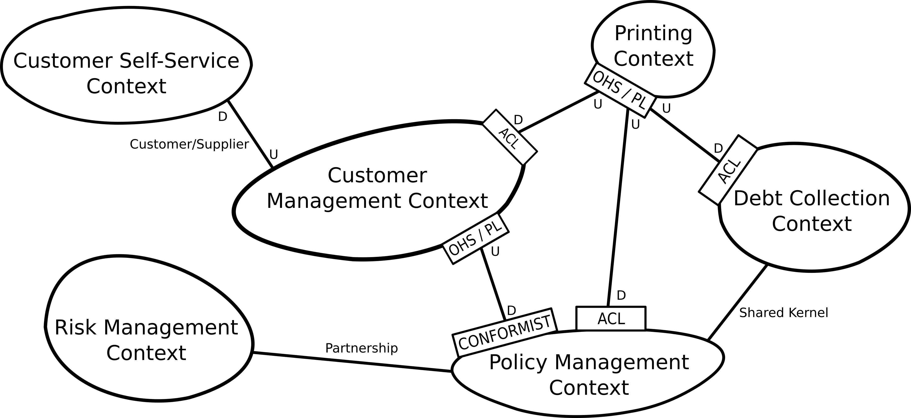
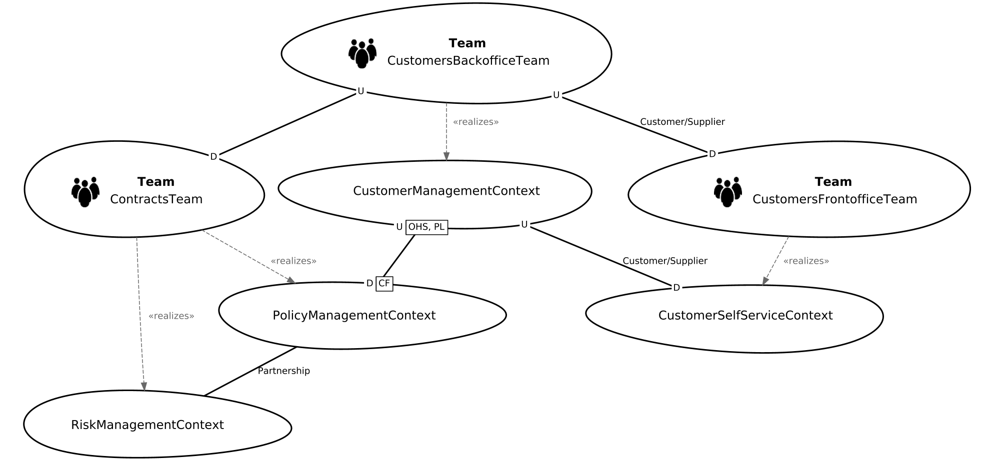
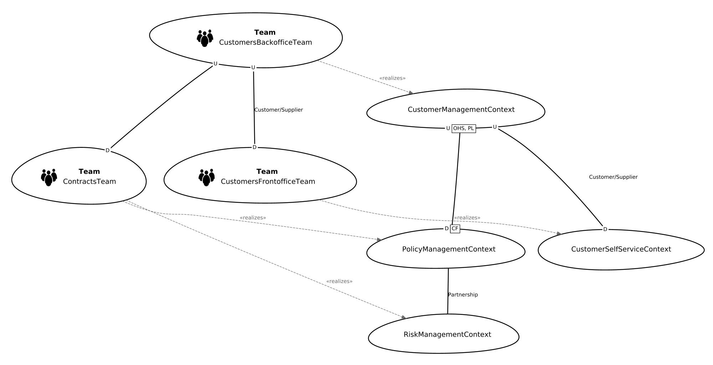

# Insurance Company Example
This example illustrates the Context Mapper DSL capabilities on the basis of a fictitious insurance company scenario. The bounded contexts are partially inspired by the [Lakeside Mutual](https://github.com/Microservice-API-Patterns/LakesideMutual) project.
Note that the goal of the example is to give a representative overview over the DSL's context mapping features. The contexts and their relationships may differ considerably in a real-world insurance company.

## Context Map
The following figure illustrates the Context Map in a graphical representation inspired by [Vernon][1] and [Brandolini][2].

You can find the corresponding context map in CML (Context Mapper Language) here in different versions and levels of detail (stages). The first four stages do
not contain detailed domain models and should be understandable for users without technical knowledge (business analysis only). The last stage contains details of
the domain models including attributes for all domain objects and are designed for software engineers and architects. 

 * [Insurance-Example-Stage-1](./Insurance-Example-Stage-1.cml): A simple context map without relationship patterns in upstream-downstream relationships and without details of the bounded contexts.
 * [Insurance-Example-Stage-2](./Insurance-Example-Stage-2.cml): This stage refines the relationships on the context map and adds the corresponding DDD relationship patterns.
 * [Insurance-Example-Stage-3](./Insurance-Example-Stage-3.cml): In stage three we added first details to the bounded contexts and specified the aggregates.
 * [Insurance-Example-Stage-4](./Insurance-Example-Stage-4.cml): A simple version including all domain objects but no attributes. This stage should still be understandable for users without technical knowledge.
 * [Insurance-Example-Stage-5](./Insurance-Example-Stage-5.cml): Finally, a detailed context map on the architect and engineering level. All domain objects are specified in detail (including attributes). This example further contains methods in aggregate root entities.
 * [Insurance-Example_Alternative-Relationship-Syntax](./Insurance-Example_Alternative-Relationship-Syntax.cml): The simple context map example in stage two, but illustrating the alternative relationship syntax.
 * [Insurance-Example_User_Representations](./Insurance-Example_User_Representations.scl): Service Cutter user representations file (for Service Cutter integration) to generate new service cuts

The following bounded contexts are involved in the system:
 * Customer Management
 * Customer Self-Service Management
 * Policy Management
 * Debt Collection
 * Risk Management
 * Printing Context

## Team Map
Besides classic context maps with bounded contexts, CML supports modeling teams and their relationships as it is possible with bounded contexts. This is done by simply change the type of a bounded context from SYSTEM, FEATURE or APPLICATION to TEAM. Note that the type of the context map is ORGANIZATIONAL in this case.

 * [Insurance-Example_Team-Map](./Insurance-Example_Team-Map.cml): A team map example for the insurance scenario

As you can see in the example linked above, you can further use the _realizes_ to define which teams work on which systems, applications, or features. By using the graphical Context Map generator, you can then generate team maps that illustrate the relations between development teams and system bounded contexts.

Depending how you parameterize the generator, the produced illustrations will be unclustered...

... or clustered:

## Bounded Contexts
 
### Customer Management
The customer management context is responsible for managing all the data of the insurance companies customers. Thus, it is typically a central bounded context which has relationships to many other contexts.

### Customer Self-Service Management
This context represents a web application which allows the customer to login and change basic data records like the address.

### Policy Management
This bounded context manages the contracts and policies of the customers. It works in a _partnership_ together with the risk management context, since it needs the customer risk data for calculating the customer rates. Further, it has a _shared kernel_ with the debt collection context. 

### Debt Collection
The debt collection context is responsible for the financial income of the insurance company (the debts) which depend on the corresponding contracts and policies.

### Risk Management
The risk management context works in a close _relationship_ with the policy management context and calculates risks which influence contracts and policies.

### Printing Context
This context represents an external system which is accessed by an API by many internal contexts. It handles documents which have to be printed, as for example debts, policies, etc.

[1]: https://www.amazon.de/Implementing-Domain-Driven-Design-Vaughn-Vernon/dp/0321834577
[2]: https://www.infoq.com/articles/ddd-contextmapping
