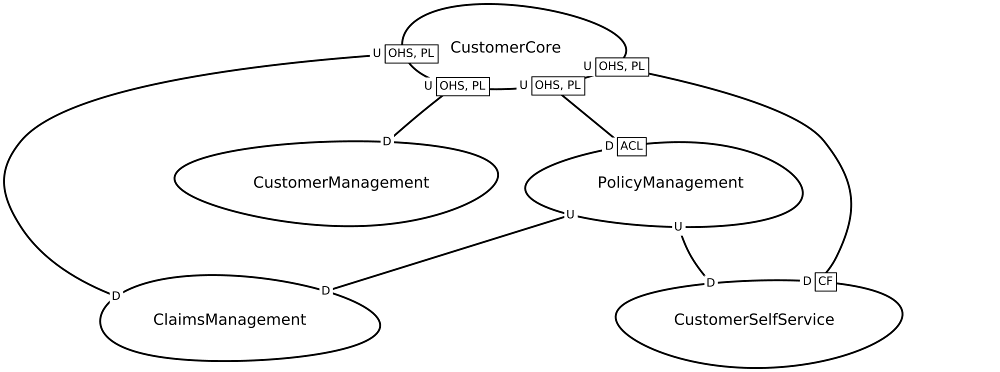

# Lakeside Mutual Example
This example illustrates Context Mapper capabilities on the basis of a fictitious insurance project called [Lakeside Mutual](https://github.com/Microservice-API-Patterns/LakesideMutual) project. The CML model of this example has been reverse engineered with our [discovery library](https://github.com/ContextMapper/context-map-discovery). With an Event Storming we have enhanced the model for a future feature that could be realized in the project (claim processing).

## Context Map
The following figure illustrates the Context Map in a graphical representation generated with our [Context Map generator](https://contextmapper.org/docs/context-map-generator/):

The complete CML model of the system can be found in the following file: [LakesideMutual.cml](./LakesideMutual.cml)

## Event Storming
We extended the reverse engineered CML model of the Lakeside Mutual to support claim processing as a future feature. We conducted an Event Storming to
analyze the subdomain for the new feature. The example shall illustrate how Event Storming results can be modeled in Context Mapper.

(a tutorial how Context Mapper can be used to model Event Storming results will be published on our website soon) 

The following graphic shows the [result of our Event Storming](https://raw.githubusercontent.com/ContextMapper/context-mapper-examples/master/src/main/cml/lakeside-mutual/images/event-storming-result.jpg):

